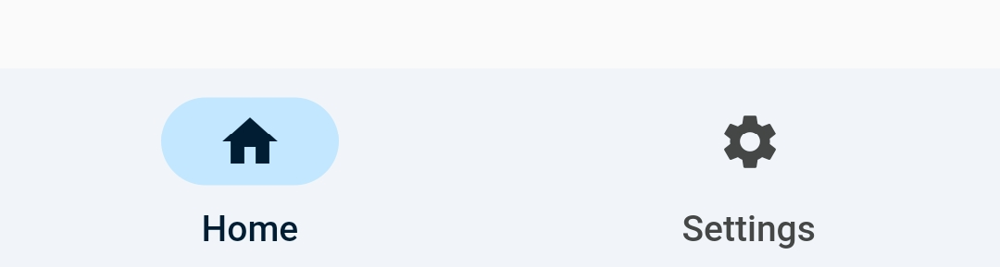
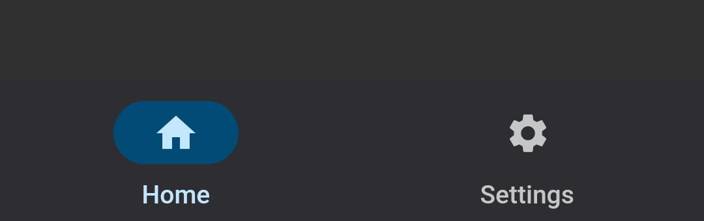

# u_navi_bar
This plugin is a simple and beautiful **Material You** styled **Navigation Bar**.


---

## Screenshots


*Light Mode*

*Dark Mode*

---

## Usage

`UNaviBar` behaves exactly like `BottomNavigationBar`. But the difference is its style and theme which is similar to **Material You**.
```dart
UNaviBar(items: [
    UNaviBarItem(context, icon: Icon(Icons.home), label: "Home"),        
    UNaviBarItem(context, icon: Icon(Icons.settings), label: "Settings"),
]),
```

---

## Contributing

If you have read up till here, then 🎉🎉🎉. There are couple of ways in which you can contribute to
the growing community of `u_navi_bar.dart`.

- Pick up any issue marked with ["good first issue"](https://github.com/TamilKannanCV-personal/u_navi_bar/issues?q=is%3Aissue+is%3Aopen+label%3A%22good+first+issue%22)
- Propose any feature, enhancement
- Report a bug
- Fix a bug
- Write and improve some **documentation**. Documentation is super critical and its importance
  cannot be overstated!
- Send in a Pull Request 😊
